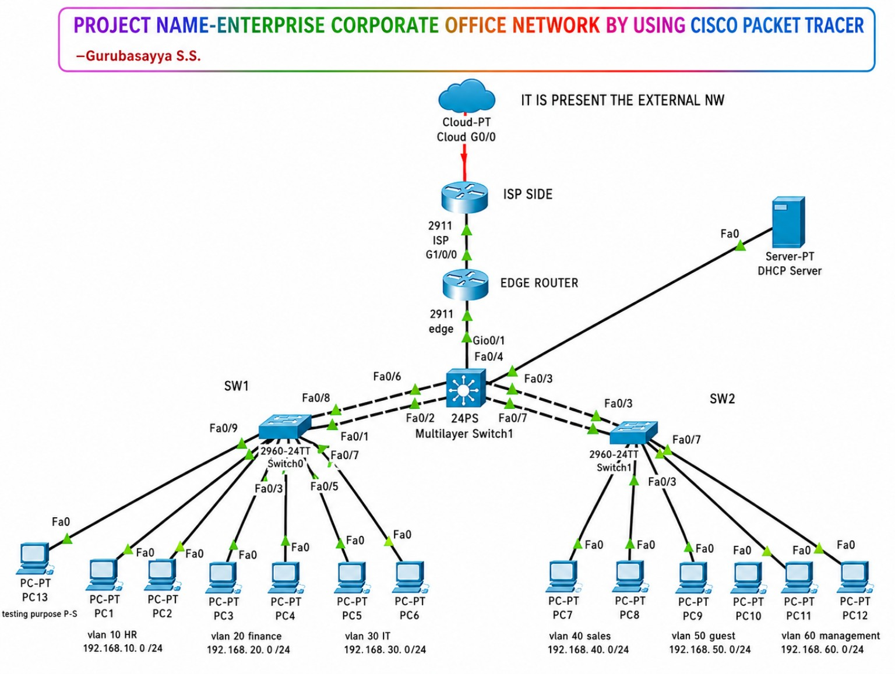

# Enterprise Corporate Office Network

A Cisco Packet Tracer enterprise network designed to simulate a corporate office using a Layer-3 core and access-layer architecture.

## Network Topology

The final topology includes an Internet/Cloud connection, ISP router, edge router, one Layer-3 core switch, two access switches, one centralized DHCP server, twelve production PCs, and one additional PC used only for Port Security testing.



### Topology Notes

- **Core Layer:** Layer-3 switch providing SVI gateways and Inter-VLAN routing.
- **Access Layer:** Two 2960 switches serving departmental PCs.
- **Server:** One centralized DHCP server at `192.168.70.10`.
- **Port Security Test PC:** PC13 is reserved for testing.
- **EtherChannel:** LACP between the Layer-3 core and access switches.
- **WAN:** Edge router connects the internal network to the ISP router and simulated Internet.

## VLAN and IP Addressing

| VLAN | Department / Purpose | Network | Gateway |
|---:|---|---|---|
| 10 | HR | 192.168.10.0/24 | 192.168.10.1 |
| 20 | Finance | 192.168.20.0/24 | 192.168.20.1 |
| 30 | IT | 192.168.30.0/24 | 192.168.30.1 |
| 40 | Sales | 192.168.40.0/24 | 192.168.40.1 |
| 50 | Guest | 192.168.50.0/24 | 192.168.50.1 |
| 60 | Management | 192.168.60.0/24 | 192.168.60.1 |
| 70 | Server / Management Services | 192.168.70.0/24 | 192.168.70.1 |
| 99 | Native / Management | 192.168.99.0/24 | 192.168.99.1 |

## Devices Used

| Device | Quantity |
|---|---:|
| Cloud-PT | 1 |
| Cisco 2911 ISP Router | 1 |
| Cisco 2911 Edge Router | 1 |
| Layer-3 Core Switch | 1 |
| Cisco 2960 Access Switch | 2 |
| DHCP Server | 1 |
| Production PCs | 12 |
| Port Security Test PC | 1 |

## Server

**Centralized DHCP / NTP Server**

- IP: `192.168.70.10/24`
- Gateway: `192.168.70.1`
- DHCP service: Enabled
- DHCP pools: HR, Finance, IT, Sales, Management and server pool as shown in the Packet Tracer configuration
- NTP server address used by switches/core: `192.168.70.10`

## Technologies Demonstrated

- VLANs
- 802.1Q Trunking
- Layer-3 Switching and SVI Inter-VLAN Routing
- LACP EtherChannel
- OSPF Area 0
- DHCP and DHCP Relay
- NAT/PAT
- Extended ACLs
- Dynamic ARP Inspection
- Port Security with Sticky MAC
- PVST
- SSH on the Core switch
- NTP
- Cisco IOS CLI
- Cisco Packet Tracer

## Core Functions

### Inter-VLAN Routing

The Layer-3 core provides default gateways through SVIs such as:

```text
VLAN 10 -> 192.168.10.1
VLAN 20 -> 192.168.20.1
VLAN 30 -> 192.168.30.1
VLAN 40 -> 192.168.40.1
VLAN 50 -> 192.168.50.1
VLAN 60 -> 192.168.60.1
VLAN 70 -> 192.168.70.1
```

### LACP EtherChannel

LACP bundles two physical links into each logical Port-Channel between the core and access layer.

Verified with:

```text
show etherchannel summary
```

The final verification showed:

```text
Po1(SU) LACP Fa0/2(P) Fa0/6(P)
Po2(SU) LACP Fa0/3(P) Fa0/7(P)
```

### DHCP Relay

The Layer-3 core forwards DHCP broadcasts from user VLANs to the centralized DHCP server using:

```text
ip helper-address 192.168.70.10
```

### Network Security

The project includes:

- Port Security with Sticky MAC addresses on access ports
- Restrict violation mode
- Dynamic ARP Inspection on selected VLANs
- Guest VLAN ACL restricting access to internal departmental VLANs
- SSH-only VTY transport on the core switch

### Routing and Internet Access

- OSPF Area 0 is configured between the Core and Edge Router.
- The Edge Router provides the default route toward the ISP.
- NAT/PAT overload is configured on the Edge Router.

## Verification

See the `verification/` directory for verification commands and captured evidence.

Important commands include:

```text
show vlan brief
show interfaces trunk
show etherchannel summary
show ip interface brief
show ip route
show running-config
show ip dhcp binding
show ip arp inspection
show port-security
```

## Project Structure

```text
enterprise-corporate-office-network/
├── README.md
├── Enterprise-Corporate-Office-Network.pkt
├── topology/
│   └── enterprise-network-topology.png
├── configs/
│   ├── Core-Switch.txt
│   ├── SW1.txt
│   ├── SW2.txt
│   ├── Edge-Router.txt
│   └── ISP-Router.txt
├── addressing/
│   └── ip-addressing-table.md
└── verification/
    ├── dai-summary.txt
    ├── lacp-summary.txt
    ├── port-security-summary.txt
    └── verification.txt
```

## Project Outcome

The project demonstrates hands-on configuration and verification of a multi-VLAN enterprise network using Cisco Packet Tracer and Cisco IOS, including Layer-3 switching, routing, link aggregation, DHCP, NAT/PAT, ACLs, Dynamic ARP Inspection, Port Security, SSH, and NTP.
